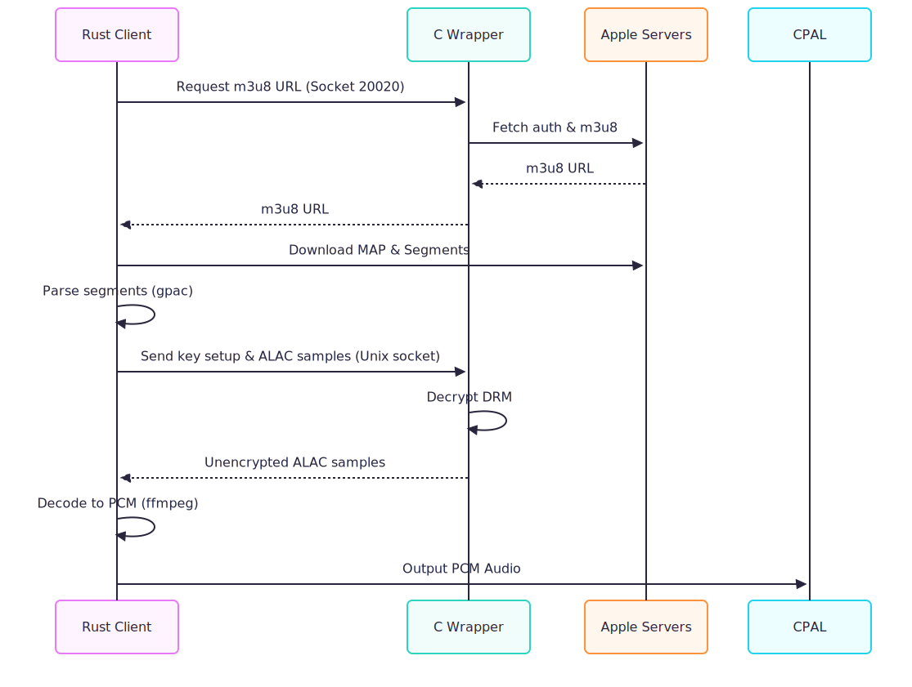
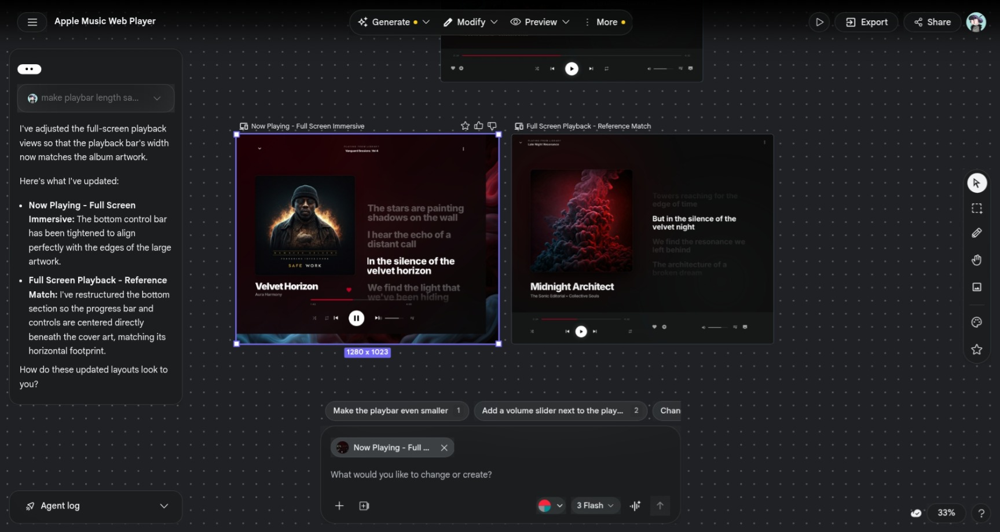

# Building a Lossless Apple Music Client for Linux
For Linux users who care about audio quality, Apple Music has long felt like a compromise. You can use the web app or Electron wrappers, but they are limited by MusicKit.JS to 256 kbps AAC streams. You can also run the Android app in Waydroid, but it does not feel native and takes a lot of space. When I realized no existing option satisfied my needs, I decided to build one myself.

> **Disclaimer:** This project is for personal use and educational research only. It relies on reverse-engineered internals and is entirely unsupported. No redistribution of Apple's binaries or copyrighted content is involved.

## Beyond 256 kbps
The Android version of Apple Music supports full ALAC lossless streaming, so I started with a simple hypothesis: Android uses the Linux kernel but a completely different userspace (Bionic libc, not glibc, and Binder IPC), so making an Android library working on Linux requires a few adjustments. I only wanted the decryption library that handles DRM and the lossless stream. My first goal was to strip away everything else and run that library as a standalone background process.

## Reverse Engineering

### Hooking Authentication
I used `frida` to analyze the authentication flow dynamically by hooking `libcurl` and capturing backtraces from each request.

```js
const handleToUrl = new Map<string, string>();

Interceptor.attach(curl_easy_setopt, {
    onEnter(args) {
        const handle = args[0].toString();
        const option = args[1].toInt32();
        if (option === CURLOPT_URL) {
            const url = args[2].readUtf8String();
            if (url) {
                handleToUrl.set(handle, url);
            }
        }
    }
});

Interceptor.attach(curl_easy_perform, {
    onEnter(args) {
        const handle = args[0].toString();
        const url = handleToUrl.get(handle) || "unknown";
        
        console.log("\n" + "=".repeat(40));
        console.log(`[->] REQUEST TO: ${url}`);
        const bt = Thread.backtrace(this.context, Backtracer.FUZZY)
            .map(DebugSymbol.fromAddress)
            .join("\n");
        console.log("Backtrace:\n" + bt);
        console.log("=".repeat(40) + "\n");
    }
});
```

```text
========================================
[->] REQUEST TO: https://s.mzstatic.com/sap/setupCert.plist
Backtrace:
0x794152d364 libmediaplatform.so!0xf6364
0x794154c564 libmediaplatform.so!0x115564
0x794154c660 libmediaplatform.so!0x115660
0x7c898eb0f8 libc.so!_ZL15__pthread_startPv.__uniq.67847048707805468364044055584648682506+0xb8
0x7c898dc328 libc.so!__start_thread+0x48
========================================


========================================
[->] REQUEST TO: https://fpinit.itunes.apple.com/v1/signSapSetup
Backtrace:
0x794152d364 libmediaplatform.so!0xf6364
0x794154c564 libmediaplatform.so!0x115564
0x794154c660 libmediaplatform.so!0x115660
0x7c898eb0f8 libc.so!_ZL15__pthread_startPv.__uniq.67847048707805468364044055584648682506+0xb8
0x7c898dc328 libc.so!__start_thread+0x48
========================================


========================================
[->] REQUEST TO: https://p27-buy.itunes.apple.com/WebObjects/MZFinance.woa/wa/authenticate
Backtrace:
0x794152d364 libmediaplatform.so!0xf6364
0x794154c564 libmediaplatform.so!0x115564
0x794154c660 libmediaplatform.so!0x115660
0x7c898eb0f8 libc.so!_ZL15__pthread_startPv.__uniq.67847048707805468364044055584648682506+0xb8
0x7c898dc328 libc.so!__start_thread+0x48
========================================
```

It looked like `libmediaplatform` was the central manager for all network requests in the Apple Music app. That meant I needed to hook thread creation to find the exact function that managed the login sequence.

```js
Interceptor.attach(pthread_create, {
    onEnter(args) {
        const start_routine = args[2];
        const mod = Process.findModuleByAddress(start_routine);
        
        if (mod && mod.name.indexOf("libmediaplatform") !== -1) {
            const routineAddr = start_routine.toString();
            const modName = mod.name;
            
            console.log("\n" + "!".repeat(40));
            console.log(`[*] Thread created with entry point in ${modName} at ${routineAddr}`);
            
            try {
                const bt = Thread.backtrace(this.context, Backtracer.FUZZY)
                    .map(addr => resolveAddress(addr))
                    .join("\n");
                console.log("Backtrace:\n" + bt);
            } catch (e) {
                console.log("Backtrace failed:", e);
            }
            console.log("!".repeat(40) + "\n");
        }
    }
});
```

This time the backtrace was demangled and resolved:

```text
[*] Thread created with entry point in libmediaplatform.so at 0x78b5869c64
Spawned by:
libmediaplatform.so!mediaplatform::WorkQueue::defaultConcurrentQueue()+0x1230
libmediaplatform.so!mediaplatform::WorkQueue::defaultConcurrentQueue()+0x93c
libmediaplatform.so!mediaplatform::WorkQueue::defaultConcurrentQueue()+0x798
libmediaplatform.so!mediaplatform::HTTPCache::lookupResponseForRequest(...)+0x15c
libmediaplatform.so!mediaplatform::HTTPRequest::startRequestWithTimeout(...)+0x36c
libstoreservicescore.so!storeservicescore::URLRequest::_applyCacheConfiguration()+0x138
libstoreservicescore.so!storeservicescore::URLRequest::runWithTimeout(...)+0x820
libstoreservicescore.so!storeservicescore::AuthenticateRequest::runWithTimeout(...)+0x158
libstoreservicescore.so!storeservicescore::AuthenticateFlow::_authenticateUsingExistingAccount(...)+0x2e0
libstoreservicescore.so!storeservicescore::AuthenticateFlow::runWithTimeout(...)+0x7c
libandroidappmusic.so!Java_com_apple_android_storeservices_javanative_account_AuthenticateFlow_run+0x64
```

The login sequence finally had a name at the top of the stack.

### Static Analysis with IDA

The backtrace had given me a name: `storeservicescore::AuthenticateFlow::_authenticateUsingExistingAccount`. I pulled `libstoreservicescore.so` out of the APK and loaded it into IDA.

The decompiler output was dense — thousands of lines of inlined C++ with mangled names and opaque `shared_ptr` chains — but the authentication function was surprisingly readable once the noise settled. Here is the critical sequence:

```c
v5 = storeservicescore::CredentialsResponse::password(v46);
storeservicescore::AuthenticateRequest::setPassword(v4, v5);
v6 = v44;
v7 = storeservicescore::CredentialsResponse::userName(v46);
storeservicescore::AuthenticateRequest::setUserName(v6, v7);
v38[0] = v44;
v38[1] = v45;
storeservicescore::ComplexRequest::setActiveRequest(a1, v38);
```

The flow goes like this: `AuthenticateFlow` holds a `CredentialsResponse` object (`v46`) populated from somewhere upstream — most likely from the Android Java layer via JNI. It extracts the password and username from that object and injects them into an `AuthenticateRequest`. That request is then handed to `ComplexRequest::setActiveRequest`, which registers it as the active network task before the actual HTTP call is made — the one we saw hitting `p27-buy.itunes.apple.com` in the Frida trace.

So the full chain, from login button to wire, looks roughly like:

```
Java AuthenticateFlow.run()
  → JNI → libandroidappmusic.so
    → storeservicescore::AuthenticateFlow::runWithTimeout()
      → _authenticateUsingExistingAccount()
        → CredentialsResponse → AuthenticateRequest
          → ComplexRequest → URLRequest
            → libmediaplatform HTTPRequest → libcurl
```

At this point I had a solid picture of the authentication pipeline. But the real problem was still unsolved: even if I knew *how* it authenticated, I still needed to actually *invoke* it — which meant initializing the library, setting up all the JNI scaffolding, and managing the entire Android runtime environment. That was going to take months.

I was scrolling GitHub when I stumbled across [`WorldObservationLog/wrapper`](https://github.com/WorldObservationLog/wrapper). Someone had already done the hard part: a C program that bootstraps a minimal Android environment inside a `chroot`, loads the library, and exposes decryption over a Unix socket. It was exactly what I needed. The only catch was that it required root.

### Rootless Container Isolation

The C wrapper is maintained in a separate repository. To use it without root privileges, I created a patch that runs it inside a user namespace, mapping the real UID/GID to root inside the namespace. The key changes were: set up the user namespace before `chroot`, write the UID/GID maps, and treat `mknod` failures as non-fatal since device node creation is generally not permitted in rootless namespaces.

PS: The project has since implemented rootless support using user namespaces.

```diff
+    gid_t gid = getgid();
+
+    if (unshare(CLONE_NEWUSER | CLONE_NEWNS | CLONE_NEWPID) != 0) {
+        perror("unshare");
+        return 1;
+    }
+
+    char map_buf[1024];
+    snprintf(map_buf, sizeof(map_buf), "0 %d 1", uid);
+    update_map(map_buf, "/proc/self/uid_map");
+
+    int fd = open("/proc/self/setgroups", O_WRONLY);
+    if (fd >= 0) {
+        write(fd, "deny", 4);
+        close(fd);
+    }
+
+    snprintf(map_buf, sizeof(map_buf), "0 %d 1", gid);
+    update_map(map_buf, "/proc/self/gid_map");
+
     if (chdir("./rootfs") != 0) {
         perror("chdir");
         return 1;
@@ -75,16 +72,15 @@ int main(int argc, char *argv[], char *envp[]) {
         perror("chroot");
         return 1;
     }
-    mknod("/dev/urandom", S_IFCHR | 0666, makedev(0x1, 0x9));
-    chmod("/system/bin/linker64", 0755);
-    chmod("/system/bin/main", 0755);
 
-    if (has_cap_sys_admin()) {
-        if (unshare(CLONE_NEWPID)) {
-            perror("unshare");
-            return 1;
-        }
+    // Creating device nodes is generally not allowed in user namespaces, 
+    // but we try anyway in case we are running with some privileges.
+    if (mknod("/dev/urandom", S_IFCHR | 0666, makedev(0x1, 0x9)) != 0 && errno != EEXIST) {
+        // Not fatal since we might be rootless
     }
+    
+    chmod("/system/bin/linker64", 0755);
+    chmod("/system/bin/main", 0755);
 
     child_proc = fork();
     if (child_proc == -1) {
@@ -99,7 +95,12 @@ int main(int argc, char *argv[], char *envp[]) {
 
     // Child process logic
     mkdir(args_info.base_dir_arg, 0777);
-    mkdir(strcat(args_info.base_dir_arg, "/mpl_db"), 0777);
+    
+    char *mpl_db_path = malloc(strlen(args_info.base_dir_arg) + 8);
+    sprintf(mpl_db_path, "%s/mpl_db", args_info.base_dir_arg);
+    mkdir(mpl_db_path, 0777);
+    free(mpl_db_path);
+
     execve("/system/bin/main", argv, envp);
     perror("execve");
     return 1;

```
With these two changes—user namespace setup and safe non-fatal `mknod`—the wrapper ran without root privileges. With that working, I could start figuring out how to download files from Apple.

```text
[+] starting...
[+] initializing ctx...
__bionic_open_tzdata_path: ANDROID_DATA not set!
__bionic_open_tzdata_path: ANDROID_ROOT not set!
__bionic_open_tzdata_path: ANDROID_DATA not set!
__bionic_open_tzdata_path: ANDROID_ROOT not set!
[+] account info cached successfully
[+] StoreFront ID: 143471-2,31
[+] Music-Token: At0ujEri7OfQut...
[!] listening m3u8 request on 127.0.0.1:20020
[!] listening account info request on 127.0.0.1:30020
[!] listening 127.0.0.1:10020
```

The `ANDROID_DATA` and `ANDROID_ROOT` warnings are harmless — Bionic's timezone lookup silently fails when those environment variables are absent, but the library falls back gracefully and playback is unaffected.

### Streaming Pipeline

Here is the high-level architecture of the custom streaming pipeline:




The wrapper originally used TCP sockets for all IPC — simpler than dealing with the linker logic across the user namespace boundary. The socket protocol had no public documentation, so I used `WorldObservationLog/AppleMusicDecrypt` as a reference to understand the download flow:
```text
Get m3u8 url
Download and parse m3u8 to find the url for the lossless stream
Download the Fairplay encrypted audio file
Split the song into samples
Decrypt each sample
Encapsulate the samples into a m4a file
```
To get the link for the m3u8 playlist of a specific song, I wrote the song ID to the m3u8 port and read back the returned URL. I then used `reqwest` to download the file with the Apple Music app's user agent to avoid request errors. I used the `m3u8_rs` crate to parse the playlist, then iterated through the variants to find the highest-quality stream.

The original implementation downloaded the entire file at once and then fed it into a command-line tool to split it into samples for decryption. That works for a downloader, but not for a streamer, because playback cannot start until the whole song is downloaded. I instead downloaded each segment only when needed. I also avoided command-line tools and linked the underlying libraries directly, which improved speed and stability.

To initiate playback, I had to download the `MAP` (Media Initialization Segment) from the m3u8 playlist, which contains the information needed to initialize the sample parser. After that, I downloaded segments sequentially and fed them into `gpac` — specifically its C library for ISO base media file format parsing — which split them into individual ALAC samples ready for decryption.

### Socket Protocol Details

The reference Go implementation (`AppleMusicDecrypt`) communicated over TCP loopback without any issues. When I reimplemented the client in Rust using Tokio's async TCP, decryption throughput was roughly 40x slower than the Go version under the same conditions — slow enough to stall playback mid-segment. I never pinned down exactly why; something in how Tokio handles small, high-frequency reads and writes over loopback did not agree with this workload. Since both processes run on the same machine anyway, I patched the wrapper to expose a Unix domain socket and updated the Rust client to connect to it instead. Throughput matched the Go reference immediately.

For decryption, I retrieved the decryption key from the m3u8 playlist, then set up the decryptor. The binary protocol itself is unchanged from the original TCP version — only the transport changed. First, I send a setup packet with the song ID and decryption key:

**Key Setup Packet:**
| Bytes | Description |
|-------|-------------|
| 4 bytes | Reset signal (`0x00000000`) |
| 1 byte | Length of Adam ID (`N`) |
| `N` bytes | Adam ID (ASCII string) |
| 1 byte | Length of Decryption Key (`M`) |
| `M` bytes | Decryption Key |

```rust
if !current_state_key.is_empty() {
    stream.write_all(&[0, 0, 0, 0]).await?;
}

stream.write_u8(adam_id.len() as u8).await?;
stream.write_all(adam_id.as_bytes()).await?;

stream.write_u8(new_key.len() as u8).await?;
stream.write_all(new_key.as_bytes()).await?;

*current_state_key = new_key.to_string();
```
After the context is set up, I could send samples for decryption by sending the sample length, then its contents.

**Sample Decryption Packet:**
| Bytes | Description |
|-------|-------------|
| 4 bytes | Sample length (`L`), Little Endian |
| `L` bytes | Encrypted ALAC data |
| Response | `L` bytes of Unencrypted ALAC data |

```rust
stream.write_u32_le(data.len() as u32).await?;
stream.write_all(data).await?;
output.resize(data.len(), 0);
stream.read_exact(output.as_mut_slice()).await?;
```

### Decoding and Bit-Perfect Playback

At that point, I had an unencrypted ALAC sample. To play it, I needed to decode ALAC to raw PCM audio. I could feed this into a library like `ffmpeg` or `symphonia`. I chose `ffmpeg` via the `ffmpeg-next` Rust crate because it is highly stable, and most Linux systems already include `libavcodec`, which keeps the binary size down. 

The `ffmpeg` decoder takes the ALAC packets and outputs raw 24-bit or 16-bit PCM frames. 

To achieve **bit-perfect playback**, I strictly avoided any software resampling or mixing in the client. Apple Music streams can change sample rates dynamically (e.g., from 44.1kHz to 192kHz). When the stream's sample rate changes, the client detects the new PCM format and re-initializes the `CPAL` (Cross-Platform Audio Library) hardware stream to match the exact sample rate and bit depth of the source. Depending on the CPAL backend in use (ALSA, PipeWire, etc.), this allows the audio to bypass software mixing and send the exact PCM frames directly to the DAC.

### User Interface Stack

The user interface is built with **Svelte** and **TypeScript** for a fast, reactive frontend experience. It is packaged as a desktop application using **Tauri**. By default, Tauri uses `webkitgtk` on Linux, but `webkitgtk` was noticeably slow and jittery — animations stuttered and scrolling felt wrong. I replaced it with a **CEF (Chromium Embedded Framework)** wrapper, which brought rendering performance in line with a native Chromium instance. This clear separation of concerns allows the Rust backend to handle heavy lifting—like DRM decryption, networking, and audio playback—while Svelte manages the display.

For UI layout and styling iteration, I used **Stitch by Google** to rapidly generate and refine mockups without losing focus on the core audio engine. The screenshot below shows an early generated layout:



Because some Apple Music features are undocumented, populating the UI required extracting additional API calls to fetch metadata (like album art, lyrics, and artist info). I did this by opening the Apple Music web app, inspecting the browser's Network tab, and analyzing the requests and returned JSON payloads. I then replicated those requests in Rust and mapped the JSON structures directly into the Svelte components.

## Demo


## Limitations & Roadmap

### Current Limitations
- **No Offline Mode**: Playback requires an active internet connection to communicate with the Apple Music backend.
- **Single Account**: Currently hardcoded to one account session cached in the wrapper.
- **Codec Support**: The streaming pipeline contains scaffolding for multiple codecs (AAC, ALAC, etc.), but currently only the ALAC (Lossless) path is fully implemented and tested.
- **Stability**: This project relies on reverse-engineered internal APIs and Android binary blobs. It is entirely unsupported and may stop working at any time if Apple updates their streaming protocols or DRM implementation.

### Roadmap
- [ ] **Sign-in / Sign-out UI**: Add a native interface for managing user authentication without manual token caching.
- [ ] **Full Codec Support**: Implement and test all available codecs (AAC, HE-AAC, EAC3, etc.) and allow users to select their preferred quality/bitrate in the settings.
- [ ] **Flatpak Distribution**: Package the entire stack into a single, easy-to-install bundle.